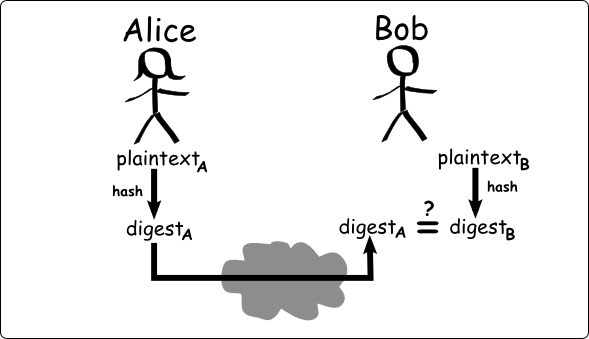

# Crypt

<div align="center">

</div>

## Table of Contents
- [About the Project](#about-the-project)
  * [Introduction](#introduction)
  
- [Getting Started](#getting-started)
  * [Prerequisites](#prerequisites)
  * [Installation](#installation)
- [Usage](#usage)
- [Acknowledgements](#acknowledgements)

## About the Project
### Introduction
This repository contains a Python 3 script that was created for the Polytechnic University of Puerto Rico's American Society of Civil Engineers Student Chapter. This little script enables the user to encrypt via hashing. Currently, the program is able to hash strings with SHA256, SHA512-256, SHA3-256 and SM3, as per the requirements provided by the organization.

## Getting Started
### Prerequisites
The script was developed in [Visual Studio Code](https://code.visualstudio.com/) with [Python 3](https://www.python.org/) and [Python 3's Pyca Cryptography Library](https://cryptography.io/en/latest/). Moreover, this program was developed using the Windows OS.
### Installation
In order to install and use this script, it is recomended to create a Python Virtual Enviroment. This can be done easily via Visual Studio Code with its built-in Terminal, as so:
1. Look at Visual Studio Code's toolbar until you see the _Terminal_ option. Now, go to **Terminal -> New Terminal**, and a new terminal should appear on your compter screen.
2. If not already in, look for the folder with the downloaded reposity with Visual Studio Code and open it.
3. Type the following commands, one after the other. Remember to press _Enter_ to move the cursos to a new line and run the previous command.
```console
python -m venv venv
venv/Scripts/activate
```
Now, with the Python Virtual Enviroment already created and activated, one should now download all the necesary dependencies for the the **asce_crypt.py** to work. This is shown as follows:
```console
pip install -r requirements.txt
```

It should be noted that the dependencies that **pip** will download are:
-  cffi==1.15.1
-  cryptography==41.0.4
-  pycparser==2.21

## Usage

The _asce_crypt.py_ script has the following parameters, namely:
-  _password_: As per the name of this parameter, it can be considered as the password text. With that being said, it is the plain text that the user of this application would want hashed.
-  _-ha_: This parameter defines the algorithm that the program will use to hash the value of the **password** parameter. The possible algorithms include: **SHA256**, **SHA512-256**, **SHA3-256** and **SM3**.
-  _-r_: This parameter represents the number of times the **password** parameter value will be hashed via the **-ha** method.
-  _-h_: Outputs the help for the program.

An example of the usage of this program is shown in the following code:
```console
(venv) PS C:\...\Crypt> python src/asce_crypt.py -ha SHA256 -r 1 123
a665a45920422f9d417e4867efdc4fb8a04a1f3fff1fa07e998e86f7f7a27ae3

## Acknowledgements
-  [SHA-256 | Complete Step-by-Step Explanation](https://www.youtube.com/watch?v=orIgy2MjqrA)
-  [Secure Hash Algorithms - Wikipedia](https://en.wikipedia.org/wiki/Secure_Hash_Algorithms)
-  [SM3 (Hash Function) - Wikipedia](https://en.wikipedia.org/wiki/SM3_(hash_function))

